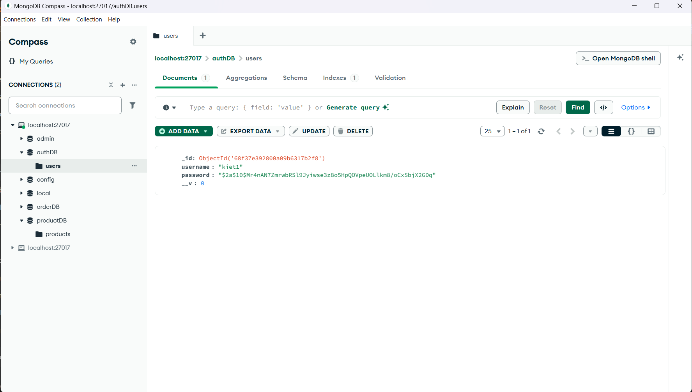

Test API trên POSTMAN

1. Register thành công

2. Register thất bại do username tồn tại 

3. login thành công, trả về token

4. login thất bại: username không tồn tại

5. login thất bại: sai pass

6. Xem Dashboard thành công
