Test API trên POSTMAN

1. Register thành công
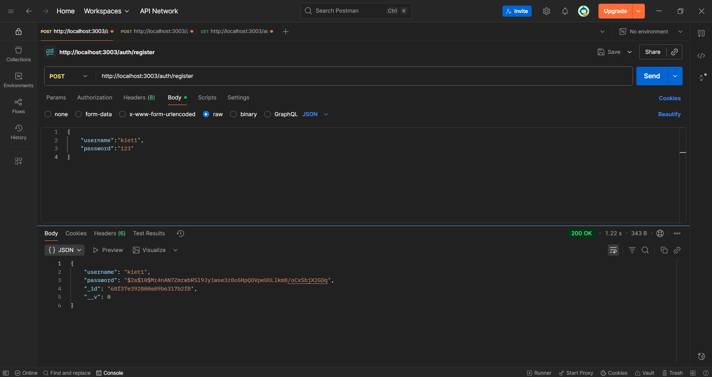</img>
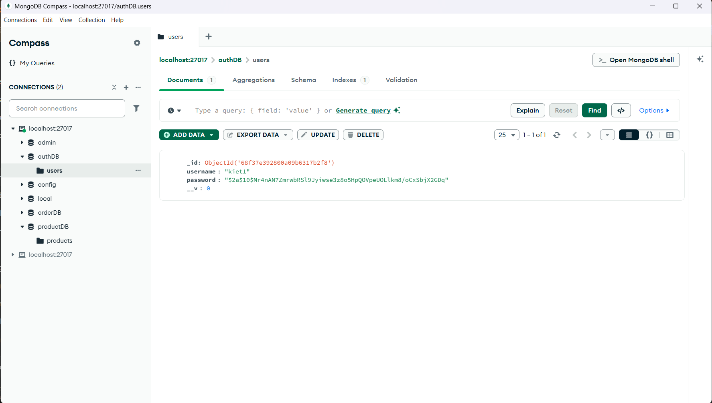</img>

2. Register thất bại do username tồn tại 
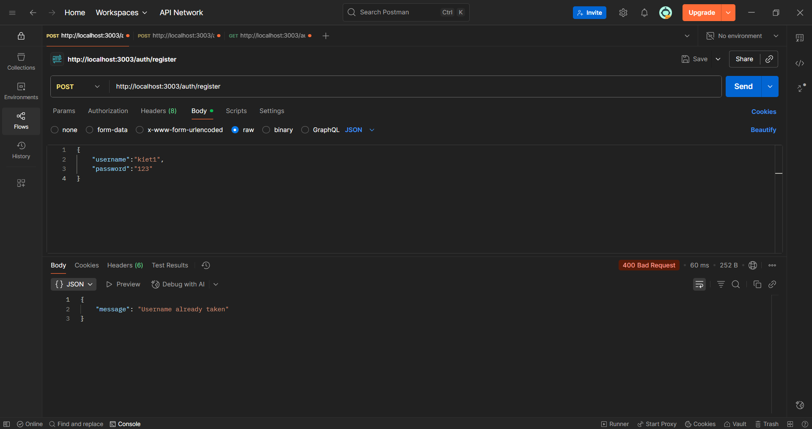</img>

3. login thành công, trả về token
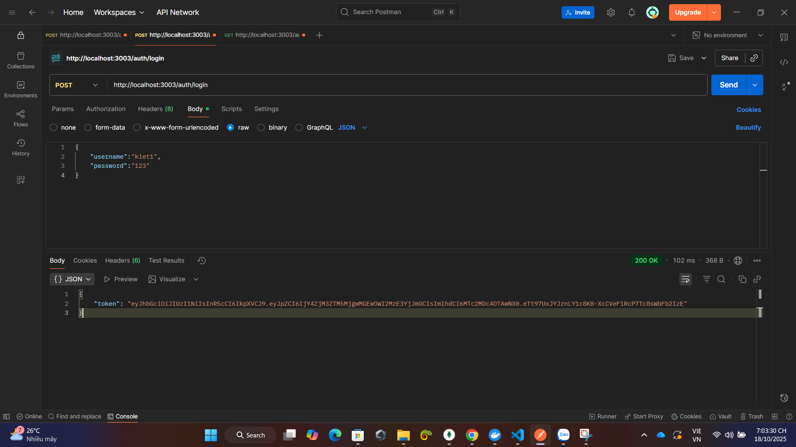</img>

4. login thất bại: username không tồn tại
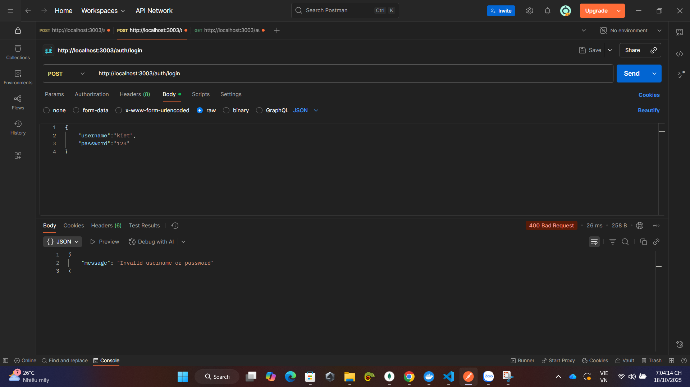</img>

5. login thất bại: sai pass
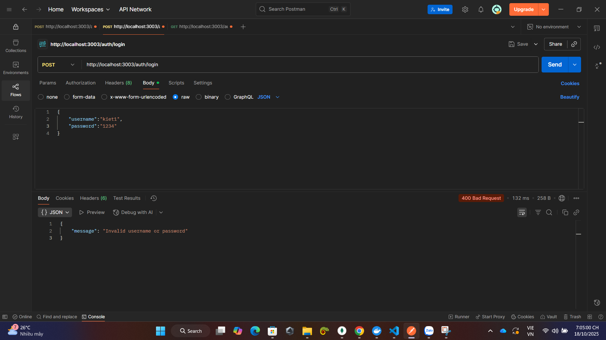</img>

6. Xem Dashboard thành công
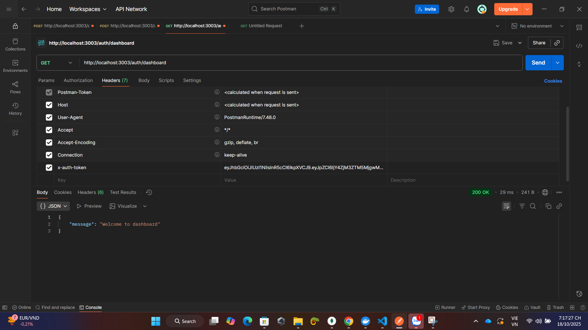</img>

7. Thêm product thành công
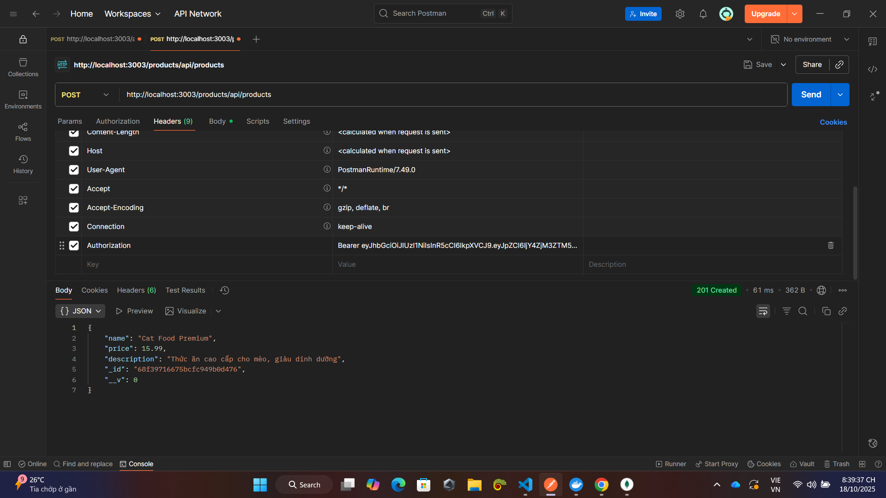</img>
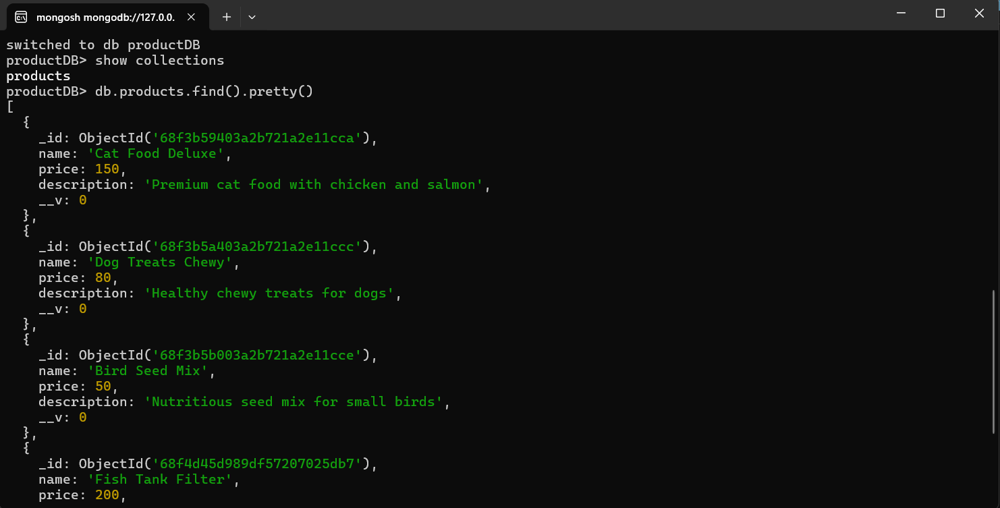</img>

8. Xem danh sách sản phẩm
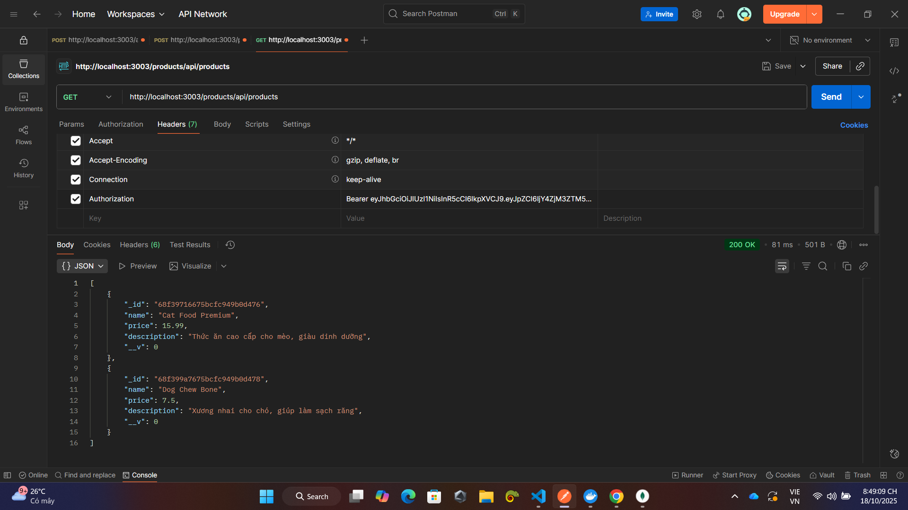</img>

9. Tạo 1 order thành công
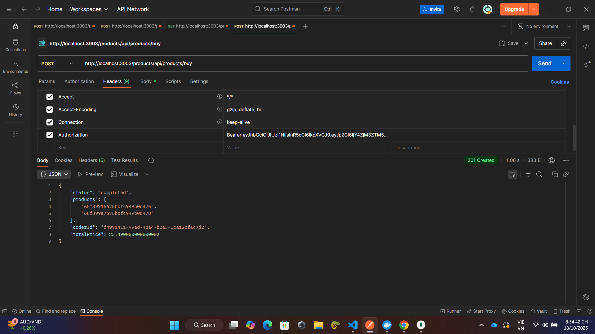</img>