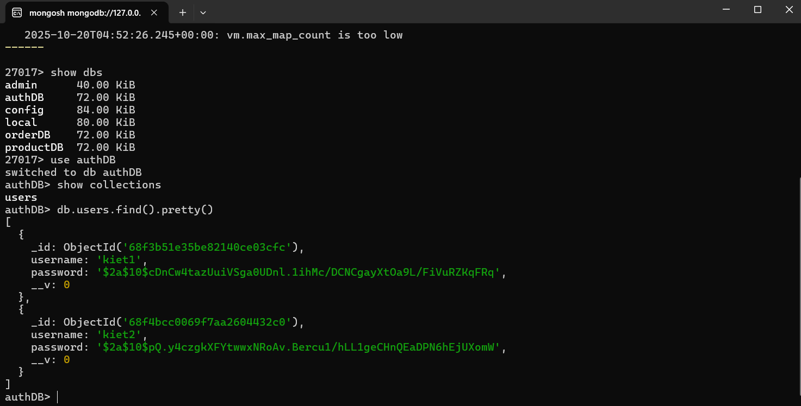
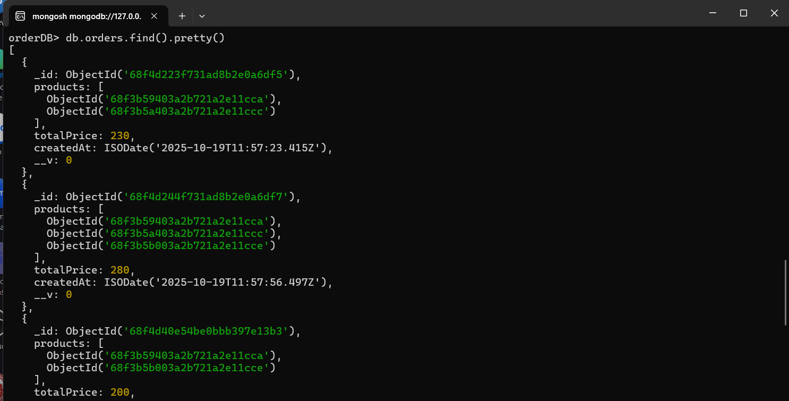
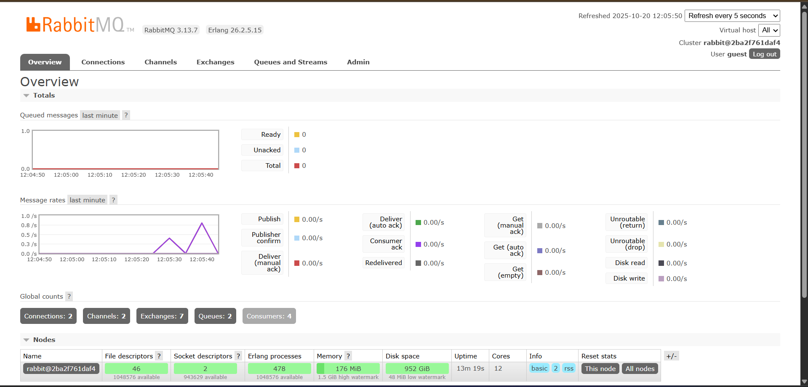
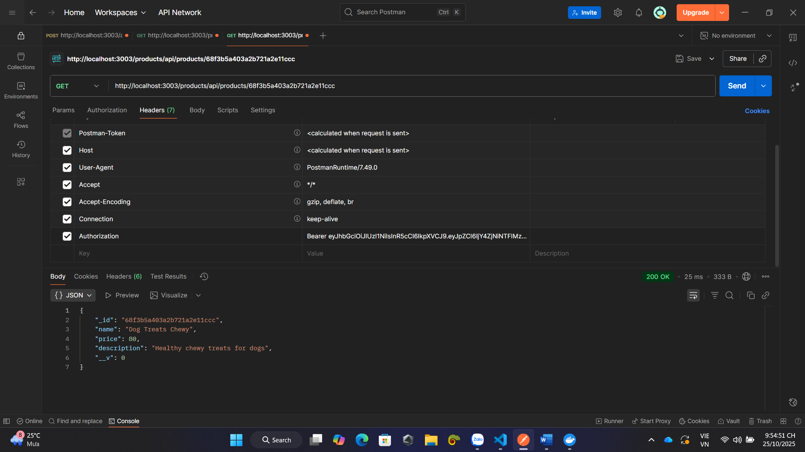
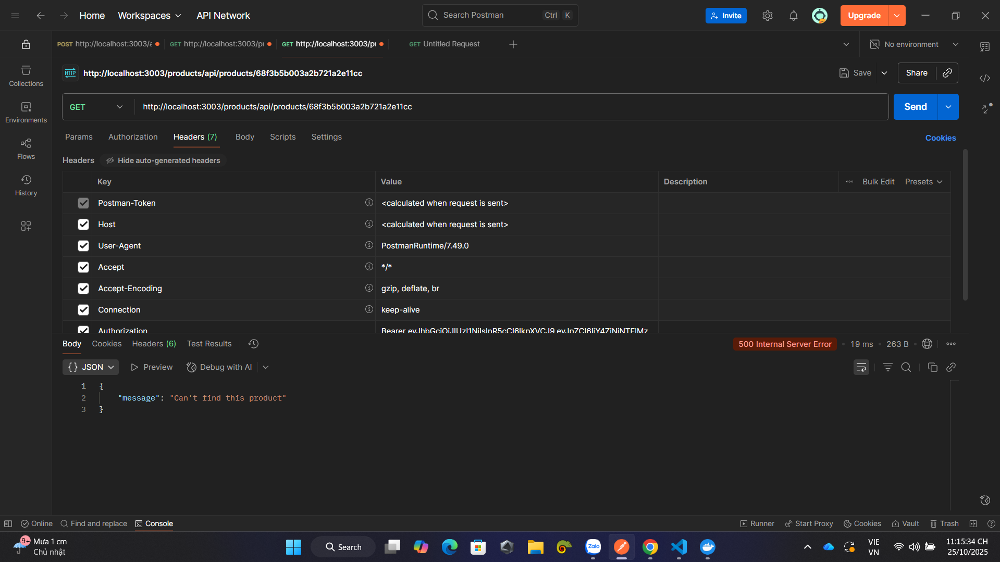

- Các URL sử dụng PORT 3003 của API GateWay sau đó API GateWay sẽ định tuyến về các dịch vụ tương ứng thông qua các endpoint và sử dụng port tương ứng của các dịch vụ đó:
- Các endpoint tương ứng: 
auth: /auth
product: /products
order: /orders

Test API trên POSTMAN: 
1. Register thành công
</img>
</img>

2. Register thất bại do username tồn tại 
</img>

3. login thành công, trả về token
</img>

4. login thất bại: username không tồn tại
</img>

5. login thất bại: sai pass
</img>

6. Xem Dashboard thành công
- Gửi kèm token x-auth-token được lấy ở bước login
</img>

Từ phần số 7 về sau sẽ gửi kèm token authorization cũng được trả về ở bước login: Bearer token (có khoảng trắng)
7. Thêm product thành công
</img>
</img>

8. Xem danh sách sản phẩm
</img>

9. Tạo 1 order thành công
</img>
</img>
</img>

10. Tìm sản phẩm theo ID
</img>
11. Tìm sản phẩm theo ID thất bại
</img>